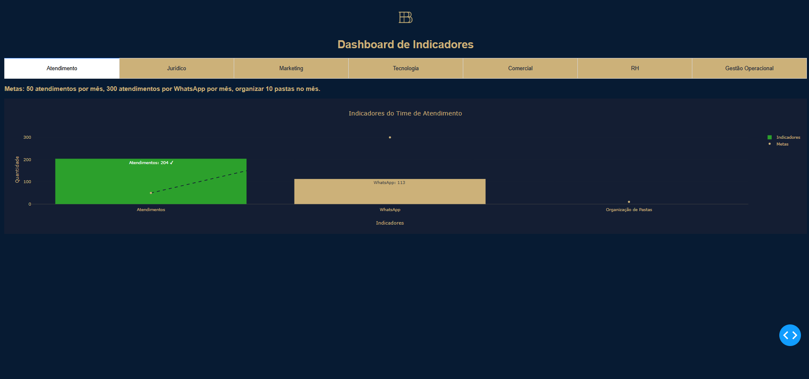

# 📊 **Dashboard de Indicadores - Bocayuva Advogados**

Este projeto é um **dashboard interativo** desenvolvido com **Dash** e **Plotly**, utilizado para monitorar e analisar os indicadores de desempenho das diversas áreas do escritório Bocayuva Advogados.

---

## 🚀 **Sobre o Projeto**

O objetivo deste dashboard é apresentar, de forma visual e dinâmica, o progresso das metas de equipes como **Atendimento**, **Jurídico**, **Marketing**, **Comercial**, **RH** e **Gestão Operacional**. Ele fornece insights valiosos para tomada de decisões e acompanhamento de desempenho.

🔹 **Principais Funcionalidades:**
- Gráficos interativos para cada área.
- Atualização automática dos dados a cada 30 segundos.
- Análise de metas atingidas e pendentes com indicadores visuais.
- Tabs para fácil navegação entre os setores.

---

## 🛠 **Tecnologias Utilizadas**

- **Python**
  - Pandas para manipulação de dados.
  - Dash e Plotly para criação do dashboard interativo.
- **Flask** para o backend do aplicativo Dash.
- **Base de dados:** Arquivos Excel e CSV.
- **Outros:** Integração com imagens e design responsivo.

---

## 📂 **Organização do Projeto**

- `app.py`: Arquivo principal do dashboard.
- `mnt/data`: Contém os arquivos de dados utilizados (Excel e CSV).
- `img/logo.jpg`: Logotipo utilizado no cabeçalho do dashboard.

### **Estrutura de Dados:**
- `Structured_DADOS.xlsx`: Dados de Marketing.
- `Agenda.xlsx`: Dados de agendamentos e atividades.
- `glpi_updated.csv`: Dados de chamados e SLA.
- `Comercial.xlsx`: Dados de desempenho comercial.
- `RH.xlsx`: Dados de RH e treinamentos.
- `Gestao_Operacional.xlsx`: Dados de gestão operacional.

---

## 🎯 **Indicadores Monitorados**

### Atendimento:
- Meta de atendimentos: 50/mês.
- Meta de atendimentos via WhatsApp: 400/mês.
- Organização de pastas: 10/mês.

### Jurídico:
- Despachos por advogado: 5/mês.
- NPS enviados: 5/mês.

### Marketing:
- Posts no Instagram: 12/mês.
- Posts no Facebook: 8/mês.
- Posts no LinkedIn: 2/mês.
- Briefings: 1/trimestre.

### Comercial:
- Contatos realizados: 150/mês.
- Contratos fechados: 10/mês.
- NPS enviados diariamente: 5/dia.
- NPS fechado no mês: 94/mês.
- Relatórios: 1/mês.

### RH:
- Treinamentos: 1/mês.
- Avaliação de cultura: 1/ano.
- Ação de integração: 1/ano.

### Gestão Operacional:
- Treinamento em gestão empresarial: 1/mês.
- One:One: 1/trimestre.
- Weekly: 4/mês.
- Relatórios de desempenho: 1/trimestre.

---

## 🔧 **Como Executar o Projeto**

1. Clone o repositório:
   ```bash
   git clone https://github.com/seu-usuario/dashboard-indicadores.git
   ```

2. Instale as dependências:
   ```bash
   pip install -r requirements.txt
   ```

3. Certifique-se de que os arquivos de dados estão na pasta correta (`mnt/data`).

4. Execute o aplicativo:
   ```bash
   python app.py
   ```

5. Acesse o dashboard no navegador:
   ```
   http://127.0.0.1:8050
   ```

---

## 📸 **Preview do Dashboard**


### Gráficos de Indicadores:



---

## ✨ **Próximas Implementações**

- Adicionar filtros personalizados para cada área.
- Melhorar o design responsivo para monitores maiores.
- Integração com APIs externas para coleta de dados em tempo real.
- Geração de relatórios PDF automáticos.

---

## 📞 **Contato**

- **Email:** williamdf2308@gmail.com
- **LinkedIn:** [https://www.linkedin.com/in/williamsousa-dev/](https://www.linkedin.com/in/williamsousa-dev/)

---